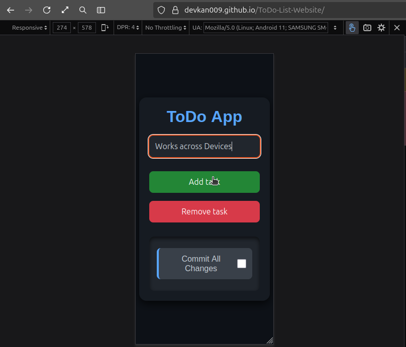

# ToDo List Web App

This is a simple and stylish ToDo List web application that allows users to add, mark, and remove tasks. The app features a modern dark theme and is fully responsive for use on both desktop and mobile devices.

## Features
- Add tasks to the list.
- Mark tasks as completed (with a line-through and dulled appearance).
- Remove tasks from the list.
- Stylish dark theme with responsive design.

## How to Use
1. **Open the App**:
   - Open the `index.html` file in your browser.

   
   

2. **Add a Task**:
   - Enter a task in the input field labeled "Enter your tasks."
   - Click the "Add task" button to add the task to the list.

   
   

3. **Mark a Task as Completed**:
   - Click the checkbox next to a task to mark it as completed.
   - The task will appear dulled with a line-through effect.

   
   

4. **Remove a Task**:
   - Click the "Remove task" button.
   - Then, click on the task you want to remove. Only the first clicked task will be removed, and the "Remove task" button must be clicked again to remove another task.

    
    

5. **Responsive Design**:
   - The app adjusts to different screen sizes, making it usable on both desktop and mobile devices.
 
    
    
## Files in the Project
- **index.html**: The main HTML file for the app.
- **style.css**: The CSS file for styling the app.
- **app.js**: The JavaScript file for app functionality.

## Installation
1. Clone the repository:
   ```bash
   git clone <repository-url>